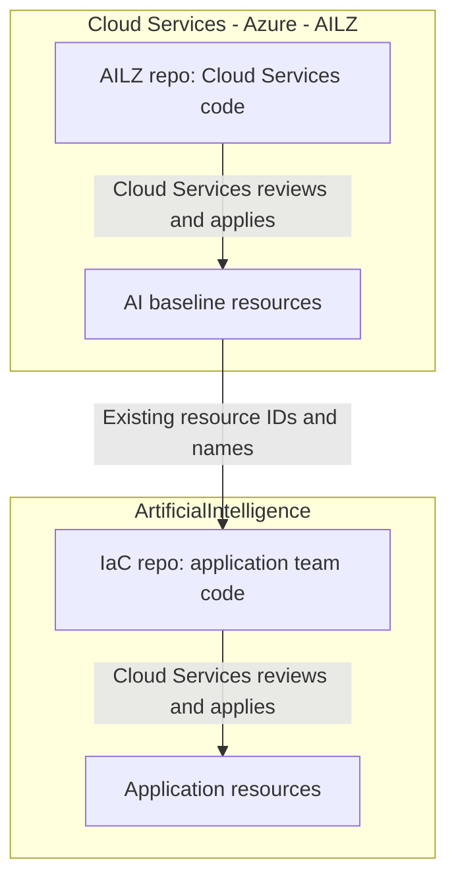
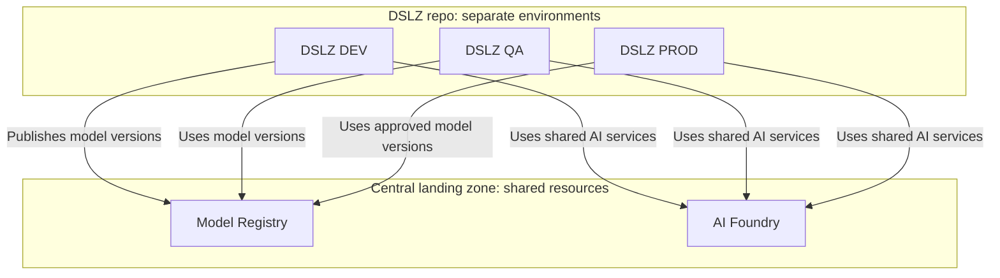
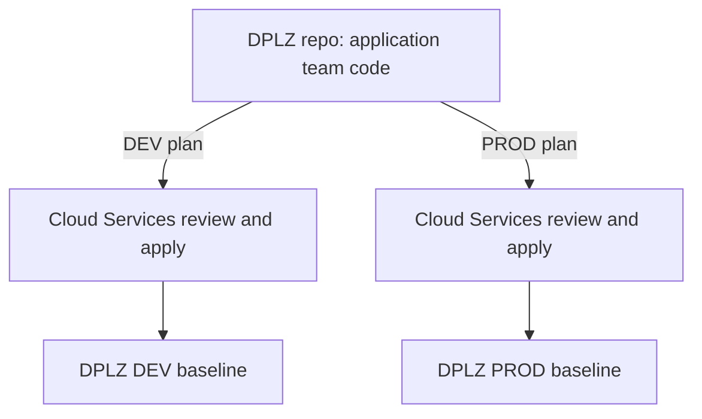

# Azure Landing Zones — Purpose, Ownership and State

## About this document

This document explains each repository's purpose, resource scope, Terraform code ownership, deployment responsibility, shared information and state storage. It covers **AILZ and IaC**, **DSLZ and Central**, then **DPLZ**, ending with the reasons for the ownership model and DSLZ's environment branches.

It uses the supplied architecture documents and the ownership and implementation details provided in this discussion. Planned and optional resources are identified below.

**Deployment responsibility:** Cloud Services representatives review the Terraform plans, approve the deployment gates and apply the approved plans for all repositories described here.

## 1. AILZ and the IaC workload repository

### AILZ: the AI platform baseline

**ADO project:** Cloud Services - Azure - AILZ  
**Repository:** AILZ

AILZ provides the baseline on which AI applications can be deployed. Its documented scope includes:

- **Network foundation:** Resource group, VNet/subnets, hub connectivity and Private DNS integration.
- **Platform services:** Key Vault, Storage, Log Analytics, Container Apps Environment and Container Registry definitions.
- **AI capabilities:** AI Foundry, AI projects/model deployments, AI Search and Cosmos DB definitions.
- **Access and traffic components:** Bastion, Application Gateway and API Management configuration.

Optional definitions do not confirm deployment in every environment.

### IaC: application and shared workload services

**ADO project:** ArtificialIntelligence  
**Repository:** IaC

IaC contains the application deployment layer: GRC Function App, GRC AI Search, Easement Document Intelligence, shared App Service/Application Insights components and Foundation Data Factory resources.

IaC receives existing **subnet IDs, Key Vault IDs, resource names and DNS zone references** through pipeline inputs or resource discovery. **AILZ owns the subnet; IaC owns its workload Private Endpoint**. Easement has a subnet input, but its Private Endpoint definition is disabled.

**IaC does not read or share AILZ's Terraform state.**

### Code ownership and deployment

| Repository | Terraform code and resource scope | Plan review, approval and deployment |
|---|---|---|
| **AILZ** | **Cloud Services** manages the code for the AI landing-zone baseline, including its network foundation. | **Cloud Services** |
| **IaC** | **Application team** writes the code for application and shared workload resources that reference the AILZ baseline. | **Cloud Services** |

### State storage and access

**AILZ:** State is stored remotely in **Azure Blob Storage**, using an AzureRM backend configured through the deployment pipeline/template. The supplied document does **not** identify the storage account, container, state key, access identity or exact permissions.

**IaC:** State handling differs by workload. Its active working state is generally local to the pipeline agent.

| Workload | Persistent state / handoff documented |
|---|---|
| Shared App Service, Shared App Insights, GRC Function App | Updated state is saved in ADO pipeline artifacts and restored by later runs. GRC Function App uses the `tfstate-grc-function-app` artifact. |
| GRC AI Search and Easement | Local state is carried between Plan and Apply in the current run's artifact. Separate publication of final state after Apply is not shown. |
| Foundation Data Factory | A saved plan is published; durable Terraform state storage across runs is not demonstrated. |
| Landing-zone smoke test | Uses an AzureRM remote backend; exact storage coordinates/access are not supplied. |

Artifact-backed state is accessed through ADO. GRC Function App uses the pipeline job token to locate prior artifacts. Individual user permissions are not specified.

## 2. DSLZ and Central: the MLOps platform

Both repositories are in **Cloud Services - Azure - AILZ**.

### DSLZ: environment-specific ML resources

DSLZ provides the resources used to develop, validate and run ML workloads in **DEV, QA and PROD**:

- Azure Machine Learning workspace and compute.
- Managed DevOps Pool, environment-specific Storage and Key Vault.
- Networking, RBAC, monitoring and logging.

**DEV** supports development and training; **QA** supports validation; **PROD** supports production execution and inference. Their IAM differences are explained at the end.

### Central: shared resources in the central subscription

Central defines services reused by DSLZ environments:

- Azure Machine Learning **Model Registry** and shared **AI Foundry**.
- Container Registry, shared Storage and Key Vault.
- Access controls, monitoring and logging for central services.

Central owns these shared resources; DSLZ owns the environment-specific execution resources. Foundry is consumed centrally rather than deployed separately within each DSLZ environment.

### Code ownership and deployment

| Repository | Terraform code and resource scope | Plan review, approval and deployment |
|---|---|---|
| **DSLZ — DEV, QA and PROD** | **Application team** writes all in-scope Terraform: VNet/subnets, networking, spoke-to-hub connections, ML resources and environment IAM. | **Cloud Services** |
| **Central** | **Application team** writes all in-scope Terraform, including networking, spoke-to-hub connections and shared ML/AI resources. | **Cloud Services** |

The application team owns the resource definitions in these repositories. Cloud Services reviews the plans and applies those same approved plans to create or update the resources.

### What is shared

DEV publishes model artifacts and versions to the Central Model Registry. QA validates the selected version, and PROD consumes the approved version. DEV, QA and PROD also access shared Foundry capabilities through controlled networking and RBAC.

**All three DSLZ environments consume Central resources.** They retain their own environment resources and access boundaries.

Central also provides the supporting shared Storage, Container Registry and Key Vault listed above.

Exact pipeline variables and Terraform remote-state dependencies between DSLZ and Central are **not documented**. Whether AILZ's Foundry definitions refer to Central's Foundry resources is also unconfirmed.

### State storage and access

| Repository | Confirmed state information |
|---|---|
| DSLZ | Backend type, storage location, DEV/QA/PROD state keys, access identity and permissions are **not provided**. |
| Central | Backend type, storage location, state key, access identity and permissions are **not provided**. |

Confirm these details from each backend/pipeline configuration. Separate branches alone do not establish separate state files.

## 3. DPLZ: the data platform foundation

**ADO project:** Cloud Services - Azure - AILZ  
**Repository:** DPLZ

DPLZ is a standalone data platform landing zone with **DEV and PROD** configurations. It provides:

- Resource group, spoke VNet, workload subnet and Private Endpoint subnet.
- ADLS Gen2 storage, whose creation appears in the referenced PROD plan.
- Storage DFS/Blob Private Endpoints, DNS associations and the connection to the enterprise vHub.

**No application, ingestion, transformation or analytics workloads are shown.** Key Vault appears in older optional configuration; its active deployment is unconfirmed.

### Code ownership, deployment and shared information

The **application team writes all DPLZ Terraform** for the landing-zone foundation, including VNet/subnets, networking, spoke-to-hub connections, storage and private access. **Cloud Services reviews, approves and applies the plans** for DEV and PROD.

DPLZ manages its landing-zone resources and connections. It consumes existing enterprise **hub IDs, DNS zone IDs, DNS resolver settings and backend details**, supplied through environment configuration and pipeline variables.

Cloud Services manages those shared dependencies; ownership by the **Central MLOps repository** is not established. DPLZ exposes resource IDs, but no consuming workload repository or direct AILZ/DSLZ dependency is confirmed.

### State storage and access

DPLZ uses an **AzureRM backend in Azure Blob Storage**. The supplied notes record:

| Setting | Value |
|---|---|
| Resource group | `rg-azumanage-flz-state-westus3-001` |
| Storage account | `stoazuflzwes001umsg` |
| Container | `flz-tfstate` |
| DEV state key | `dev/stacks/data-lz-core/terraform.tfstate` |
| PROD state key | `prod/stacks/data-lz-core/terraform.tfstate` |

**DEV and PROD use different state files within the same documented backend.** Each pipeline uses its service-connection identity with Entra ID authentication. The notes identify Reader access for metadata lookup, Storage Blob Data Contributor at the container/account, backend subscription visibility and an agent network path as required.

PROD previously lacked backend subscription visibility; its resolution is not documented. These backend coordinates must not be assumed to apply to AILZ, DSLZ or Central.

## 4. Functional similarities and differences

The common pattern is controlled access, private connectivity and reuse of platform services. The functional distinction is:

| Repository | Main function |
|---|---|
| AILZ | Establish the AI application baseline. |
| IaC | Define application and shared workload resources using that baseline. |
| DSLZ | Provide environment-specific ML execution. |
| Central | Share model versions and ML/AI services across DSLZ environments. |
| DPLZ | Establish the data platform foundation. |

## 5. Why the repository ownership model changed

**Earlier AILZ/IaC model:** AILZ and IaC existed before the MLOps platform. Cloud Services did not permit the AI Foundation application team to manage the landing-zone network foundation in IaC. Cloud Services therefore managed that baseline through AILZ, while the application team wrote IaC workload definitions referencing existing baseline resources. Cloud Services handled deployment for both.

**Later DSLZ/Central/DPLZ model:** The team subsequently obtained agreement to author Terraform for all components within these repositories, including VNet/subnets, networking, spoke-to-hub connections and the relevant platform, shared or workload resources. Cloud Services retained the deployment gates: its representatives review the Terraform plans, approve them and apply those same plans. DPLZ's current scope remains foundation resources only.

## 6. Why DSLZ uses separate environment branches

During MLOps development, **Logic 2020 raised RBAC issues**. The decision was to retain the existing DEV environment and its higher privileges, while configuring QA and PROD IAM through dedicated environment-specific stacks. This introduced configuration differences between DEV and the higher environments.

To accommodate those differences without the time required to reconfigure the existing setup, **DSLZ was split into three branches within the same repository—one for each environment**. The preferred approach was a shared main branch with environment-specific variable files, but the branch split addressed the implementation constraints at that time.
